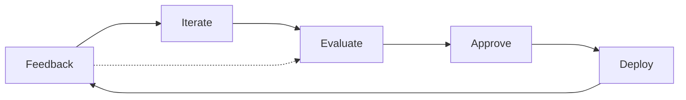

# Evaluating LLM-based Applications - Josh Tobin - LLMs in Prod Conference Part 2

## Outline
- why evaluation
- what makes evaluation difficult?
- the problem with benchmarks
- building your own evaluation set
- choosing evaluation metrics
- the role of human evaluation

All about evaluation of LLM models an their application to your data. 

Evaluation provides:
- validation that your model avoids common failure modes
- common language to make fast go/no-go product decisions
-  roadmap for improvements to model performance

Evaluation should be:
- correlated with outcomes
- a single metric (that can be sliced up)
- fast and automatic to compute
- 

![[Pasted image 20230816082040.png]]

Traditional ways of testing ML models don't apply to new, generative applications of LLM's. 
Often not possible to access training distribution (or just impractical) and the production distribution is so massive that it probably doesn't apply to your specific application.

Better data, better metrics -> better evaluation set

Publicly available benchmarks are valuable if they in some represent your problem.

Problems with general benchmarks
- they don't measure performance on **your use case**
- they don't take into account your prompting, your in-context learning, your fine-tuning, etc.
- they also have all of the measurement issues we're talking about

### Building out an evaluation dataset for your task

1. start incrementally
	- 
2. use you llm to help 
3. add more data as you roll out

Identify "interesting" cases
use your llm to generate test cases
Identify things your users dislike, annotators dislike, 

### Choosing Evaluation metrics

- regular eval metrics - accuracy, etc.
- reference matching metrics
	- semantic similarity
	- ask another llm if the answers are consistent
- "which is better" metrics - using another llm
- "is the feedback incorporated" metrics - using another llm
- static metrics
	- very the output has the right structure
	- ask a model to grade the answer on a scale

Can using llm to evaluate automatically work? yes but there are some limitations
- biases in the llm's 
	- models tend to prefer their own answers (compared to humans other models)
- order of responses matters
- llm's prefer longer responses
^ these may be mitigated over time though

Human-verified llm eval is valuable

### Role of human evaluation

People are inconsistent when grading on a scale
More reliable at A vs B evaluations
Humans also have their own biases

Limitations:
- quality
- cost
- speed

### A Process to Follow

Inspired by test-driven development

Feedback -> Iterate -> Evaluate -> Approve -> Deploy                 (repeat)

Build an evaluation set and add evaluation criteria over time.

#### 🧭  Idea Compass
- West  (similar) 
[[Machine Learning]]
[[Large Language Models]]
[[Computer Science]]

- East (opposite)

- North (theme/question)
[[Quality Assurance]]
[[Model Evaluation]]

- South (what follows)