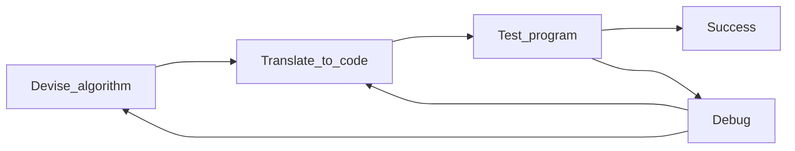

# Seven Steps for Algorithm Design

Part of the [[Python Programming Fundamentals Course]]

1. Devise algorithm 

5. Translate to Code
6. Test Program
7. Debug program
8. Program appears correct 

Algorithm: a clear set of steps to solve any problem in a particular class

## Step 1: Work an Example yourself

Pick a set of parameters and work through at least one instance.
Can be helpful to draw a diagram of the problem.

## Step 2: Write Down What You Just Did

Identify a clear set of instructions that anyone else could follow to reproduce your answer for the particular instance you chose
Avoid glossing over 'easy' steps

## Step 3: Generalize Your Steps

Look for patterns or potential patterns in the instance(s) solved.
Look for repetition in the steps that are taken.
- how many times and what the step is
It may be difficult to see a pattern, return to steps 1 and 2 when this is the case.

## Step 4: Test Your Algorithm

Test your algorithm using different parameters.
The more test cases used, the more confident we can be that the algorithm is correct.
The only way to be completely sure an algorithm is correct is to formally prove its correctness using a mathematical proof.

## Step 5: Translating Algorithms to Code

Repetition -> `for` and `while` loops
Decision making -> `if` , `else` and `elif`
Math -> computation
Names -> 
- be sure to initialize your variables by assigning a value before you use it

Use a `return` statement to return the computed answer

Complex Steps:
- complex lines should be broken down into smaller functions to perform the work of that step
- many Python libraries exist with useful functions that can be used
- use comments for new functions, potentially have them start as pseudocode

## Step 6: Test Program

Think about difficult cases of the problem.

## Step 7: Debug Program

#### 🧭  Idea Compass
- West  (similar) 
[[Computer Science]]
[[Python Programming Fundamentals Course]]

- East (opposite)

- North (theme/question)

- South (what follows)
